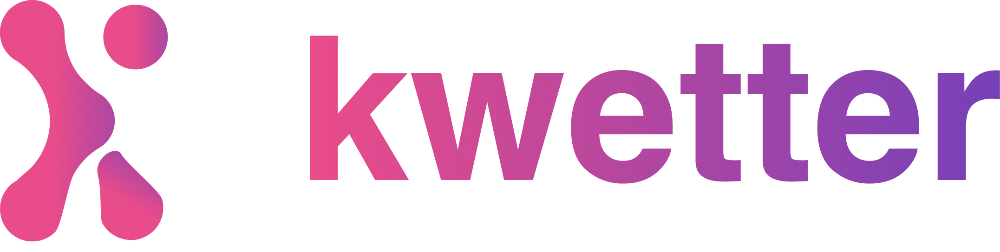

<h3 align="center">
  <a href="https://github.com/benawad/dogehouse/blob/staging/CONTRIBUTING.md">Contribute</a>
   · 
  <a href="https://discord.gg/82HzQCJCDg">Community</a>
   · 
  <a href="./docs/README.MD">Documentation</a>
</h3>

Official documentation for Kwetter.

## Structure
| Codebase                                                      |      Description          | 
| :-----------------------------------------------------------: | :-----------------------: | 
| [docs](https://github.com/kwetterr/docs)                      | Official Documentation    |
| [ui](https://github.com/kwetterr/ui)                          | VueJS front-end           |
| [user-service](https://github.com/kwetterr/user-service)      | .NET core API             |
| [friend-service](https://github.com/kwetterr/friend-service)  | .NET core API             |
| [kwat-service](https://github.com/kwetterr/kwat-service)      | NodeJS API                |

## Contributions
Checkout our quickstart in [CONTRIBUTING.md](CONTRIBUTING.md) and checkout out individual repositories next.